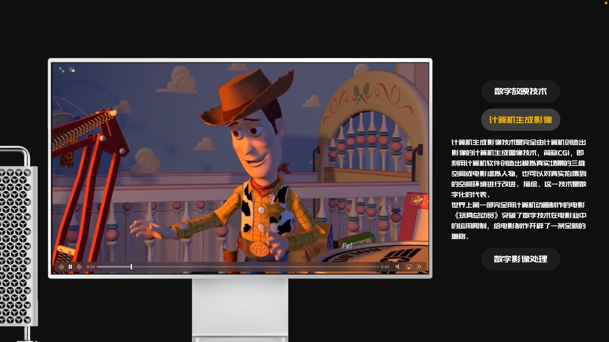
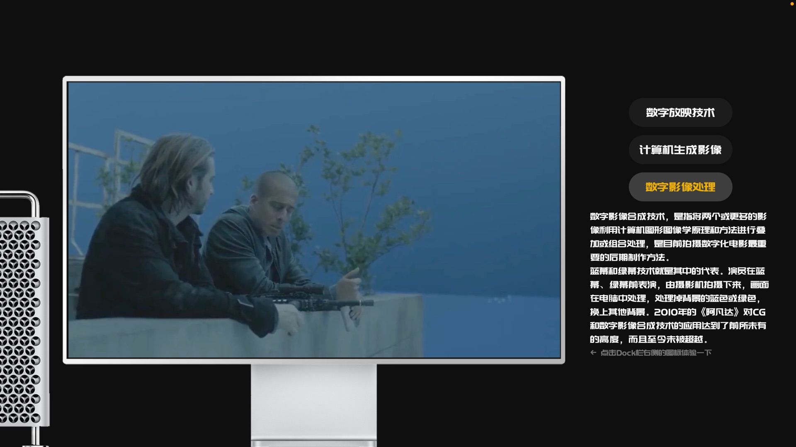

# ZeroCup2021

武汉大学2021年零杯**JS is Weird队**参赛作品

获**壹组二等奖**

## 食用方法

### 开箱即用

打开右侧GitHub Pages或下载dist文件夹后使用Live Server运行。在分辨率为1920x1080的设备上观看效果最佳。

### 继续开发

**Project setup**

```
npm install
```

**Compiles and hot-reloads for development**

```
npm run serve
```

**Compiles and minifies for production**

```
npm run build
```

## 内容介绍

> 这部分的内容撰写于提交初赛作品前，初赛到决赛之间所作的修改**未包括**在内。

我们的网站主题是“电影技术革新”，以电影技术发展为线索介绍各个新兴技术为电影发展带来的历史性革新。

我们的网站分为五个section进行介绍：

1. 电影的诞生
2. 最早的无声电影
3. 第一次变革——由无声电影变为有声电影
4. 第二次变革——由黑白电影变为彩色电影
5. 第三次变革——数字化电影

我们在每个板块都介绍了每次变革的先驱者以及佼佼者的作品，并设置了优美的过渡动画和妙趣横生的互动小游戏带领用户领略电影技术革新的魅力。

首屏，我们选取了电影技术革新的主题视频作为开场动画，一个摄影机扫光到屏幕，并投出“电影技术革新”的介绍文字。在动画即将结束时，会有小图标提示用户下滑进入下一页。


接下来，从电影胶卷组件从左侧飞入开始，我们介绍了电影的诞生——从“视觉暂留原理”的发现，到“诡盘”的发明，再到用幻灯播放最原始的动画片，我们选取了最早且最具代表性的电影片段放在左侧，包含世界上最早的动画《飞驰的马》、被认为是人类历史上第一部电影的《朗德海花园场景》、被认为是第一部广告片的《工厂大门》、在早期历史对人们最具影响力的《火车进站》四部电影。在电影胶卷下侧可以看见介绍文字，点击左右侧的按钮可以切换电影片段。同时，当用户点击“了解更多”按钮时，可以看到胶卷的背面，上面介绍了当时技术对电影带来的完全革新，以及一些相关的小趣事。从这一页开始左上侧的胶卷小组件开始随着页面滚动而滚动，富有趣味的同时也起到进度条的作用。


下一页，我们对早期的无声黑白电影（又称默片）进行了简要的介绍，我们选取了“银幕时代”最具代表性的默片电影《摩登时代》。在胶卷的背面我们介绍了默片演员这一在早期电影中占有重要历史性地位的职业。


接下来，我们介绍了电影历史上第一次最为重要的技术革新——从无声电影到有声电影的革新改变。我们选取了《唐璜》、《爵士歌王》两部最具有代表性的有声电影。用户“了解更多”查看胶卷背面时，可以看到留声机的介绍，以及胶卷存储声音的原理。用户可以点击右侧的“体验一下”按钮进入体验互动页面，在其中录制自己的声音，互动小游戏会显示声音波形，并具有重放功能。相信在此体验后用户会对“用胶卷曝光记录声音”这一技术突破性的历史革新有更加深刻的印象和深入的了解。


下一幕，我们介绍第二次最为重要的技术革新——从黑白电影到彩色电影的转变。随着用户滚动鼠标滚轮，在上一页左侧的电影胶卷会逐渐放大到正中央，同时“第二次变革——黑白到彩色”的文字从下方缓入。由于彩色电影的发展分为两个阶段，我们分为左右两个板块进行介绍。首先是左侧的第一阶段——手工上色。在这里我们选取了手工上色阶段的佼佼者作品——《飞向月球》，用户继续下滑时，胶卷中黑白的电影画面从上到下过渡变为彩色，同时左侧和下侧的黑色文字会逐渐变为彩色。继续下滑，第二阶段的介绍文字从右侧飞入。用户可以点击左右侧的“了解更多”查看更多信息。


第三次变革是数字化电影的出现。在进入数字化电影的介绍界面时，屏幕背景由传统化的电影背景转为纯黑色的数字页面，且左上角的电影小组件缩回。在数字化电影的介绍中，我们选取了“数字放映技术”、“计算机生成影像”、“数字图像处理“三个数字化电影时代最大的技术革新，并选取了最具代表性的介绍视频。在”数字图像处理“界面，我们主要介绍了绿幕背景和其他相关的特效技术，并引入了第二个互动游戏——用户可以上传一张带有绿幕背景的照片，选取想要扣掉的颜色并点击处理图片，即可获得一张扣出主体的图片。用户点击下方的背景图片可以更换背景。







下一幕，我们介绍了现代化的技术——从巨幕、3D、120FPS，到球幕、IMAX、杜比全景声，电影技术的发展正在不断提高电影的观感。用户继续下滑页面，中心文字不断放大、"What's next？"文字上移。随着文字不断放大且变得透明，背后的电影页面也逐渐显出。但随着用户继续滑动页面，会发现这一幕极具电影效果的画面是由手机拍出的——这可能是电影的未来——电影这一大众娱乐不再只属于专业人士和专业设备，随着科技的不断发展，普通人也能拍出电影效果。电影这种大众娱乐最终将会回到大众身边。


## 说明

网页中所用部分图片素材和所有的视频片段均来源于网络，在网页中仅作为展示用途，请勿用于其他途径。
